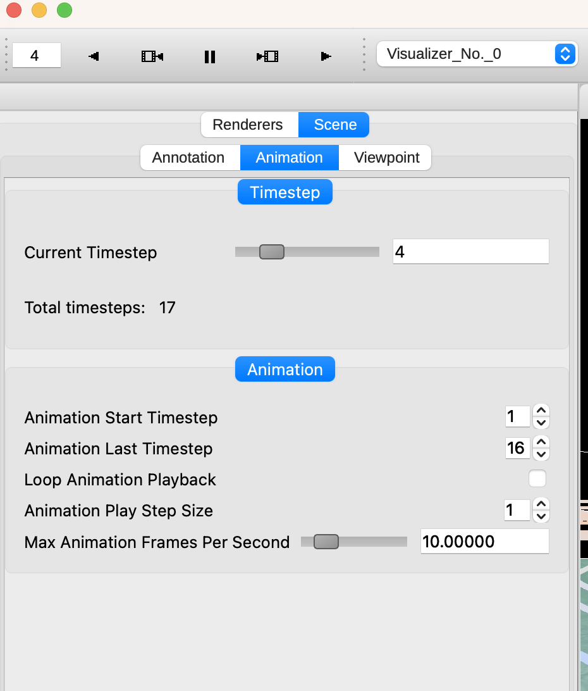

.. _navigation:

Navigation Settings
-------------------

At the top level of Vapor's control menu, there is a top-level tab called Navigation, which contains settings that help users identify and visualize where they are in the scene.  The Navigation tab is composed of an Annotation tab, and a Viewpoint tab.

Annotations
___________

In the Annotaitons tab, users can add Axis Annotations, Time Annotations, and 3D arrows that indicate which direction the X, Y, and Z axes are oriented in.  Users can also control whether they want to render bounding boxes that indicate the extents of their domain.

Animation
_________

The Animation tab provides tools to control and customize how animations are played using the animation controls at the top of the application.

- **Current Timestep**: Select the current timestep being rendered.
- **Animation Start Timestep** and **Animation Last Timestep**: Define the range of timesteps for the animation.
- **Loop Animation Playback**: Check this option to make the animation loop back to the start once it reaches the end.
- **Animation Play Step Size**: Set the increment in timesteps for each frame of the animation.
- **Max Animation Frames Per Second**: Use this slider to cap the maximum speed of the animation. This is important if you have a visualization that renders quickly (such as a 2D renderer) and the animation progresses too quickly to be useful.




Viewpoint
_________

The Viewpoint tab contains tools that let the user apply global transforms to datasets that they have loaded.  This is similar to how individual renderers can be transformed, but in this case the transform applies to all renderers in a dataset.

Projection strings can also be modified if a dataset is georeferenced.

Finally, camera position and direction values are displayed here and may be changed numerically for convenience.

.. figure:: ../_images/viewpointTab.png
    :align: center
    :width: 500 
    :figclass: align-center

    The Viewpoint Tab, within the top-level Navigation tab

Off Screen Rendering
````````````````````

Sometimes users will want to produce snapshots or animations at a higher resolution than their current display.  A rendering can be captured at 4k, or any user-defined resolution by modifying the **Framebuffer Settings** section of the Viewpoint tab.  Simply check the "Use Custom Output Size" checkbox, and enter the width and height of the image sequence you would like to capture.
